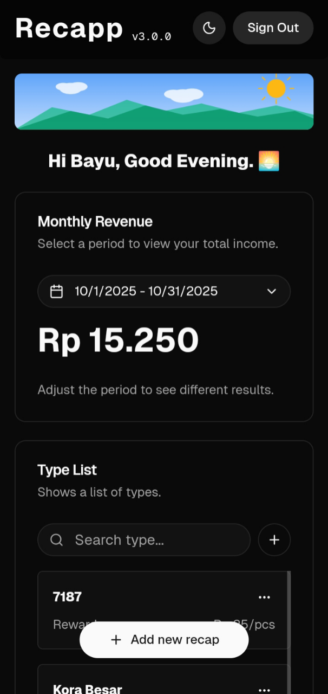
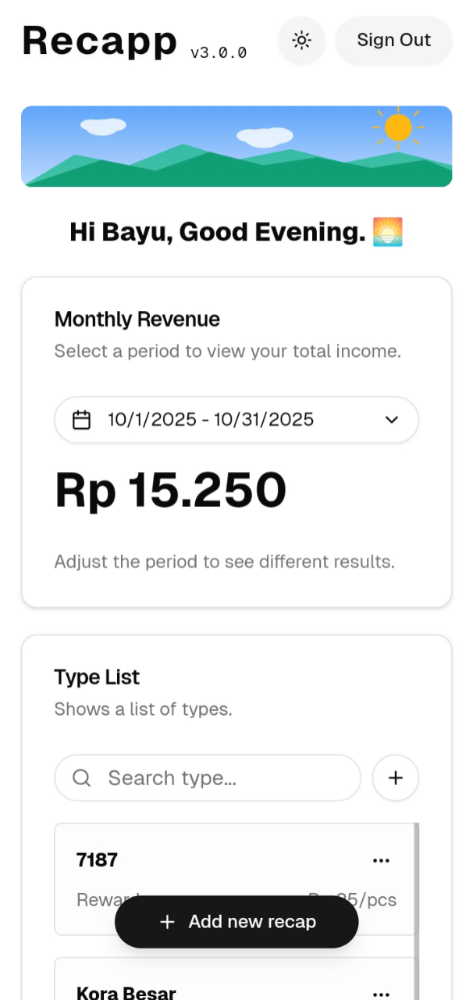

# Recapp - Productivity Report


## 📋 Overview

Recapp is a comprehensive productivity recording and reporting tool designed specifically for workers in the rubber home industry. The application streamlines the process of tracking, recording, and analyzing worker productivity, enabling better management and performance insights.

## ✨ Features

- **Worker Productivity Tracking** - Record and monitor daily productivity metrics
- **Comprehensive Reporting** - Generate detailed productivity reports
- **User-Friendly Interface** - Simple and intuitive design for easy data entry
- **Data Analytics** - Visualize productivity trends and patterns
- **Export Capabilities** - Export reports in multiple formats

## 🚀 Getting Started

### Prerequisites

Before you begin, ensure you have the following installed:

### Installation

1. Clone the repository

```bash
git clone https://github.com/oortsky/recapp-tree.git
```

2. Navigate to the project directory

```bash
cd recapp-tree
```

3. Install dependencies

```bash
# Add your installation command
npm install
```

4. Run the application

```bash
# Add your run command
npm run dev
```

## 💻 Usage

1. **Register Workers** - Add worker profiles to the system
2. **Record Productivity** - Enter daily productivity data for each worker
3. **Generate Reports** - Create and view comprehensive productivity reports
4. **Analyze Data** - Review trends and performance metrics

## 📸 Screenshots

<p align="center">
  
  
</p>

## 🛠️ Built With


## 📊 Project Structure

```
recapp/
├── src/
│   ├── app/
│   ├── components/
│   ├── contexts/
│   ├── db/
│   ├── hooks/
│   └── lib/
├── public/
└── README.md
```

## 🤝 Contributing

Contributions are welcome! Please feel free to submit a Pull Request.

1. Fork the project
2. Create your feature branch (`git checkout -b feature/AmazingFeature`)
3. Commit your changes (`git commit -m 'Add some AmazingFeature'`)
4. Push to the branch (`git push origin feature/AmazingFeature`)
5. Open a Pull Request

## 📝 License

This project is licensed under the MIT License - see the [LICENSE](LICENSE) file for details.

## 👥 Authors

- **Bayu Aprio Pamungkas** - _Full-Stack Developer_ - [OORTSKY](https://github.com/oortsky)

## 🙏 Acknowledgments

- Thanks to all contributors who have helped with this project

## 📞 Contact

Project Link: [https://github.com/oortsky/recapp-tree](https://github.com/oortsky/recapp-tree)

---

Made with ❤️ by OORTSKY
